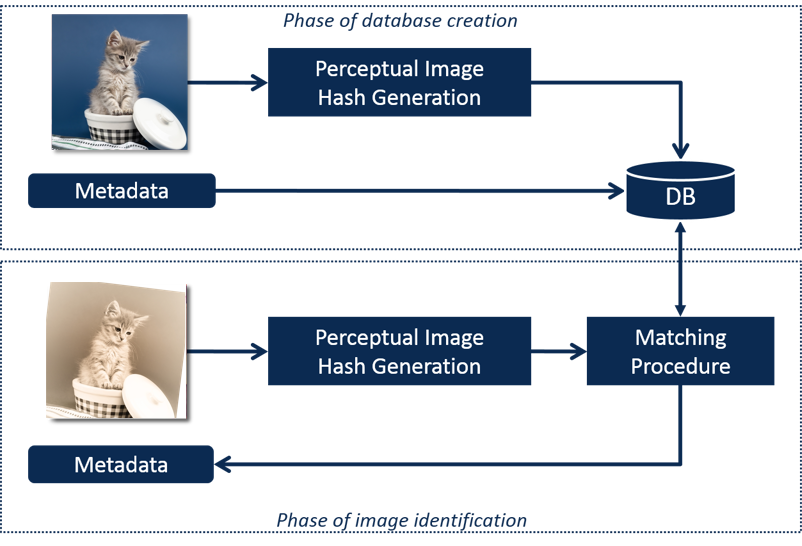
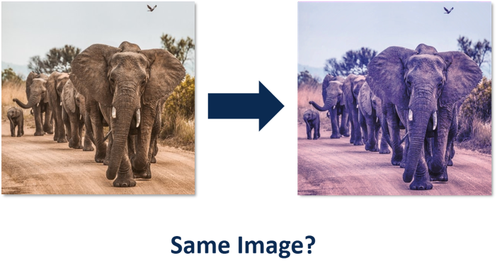
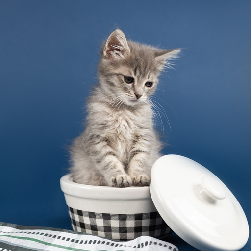
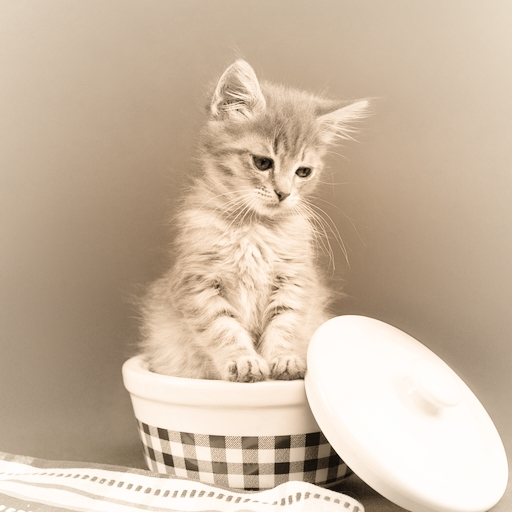

# Twizzle - A Multi-Purpose Benchmarking Framework

Twizzle was originally developed to offer an easy to use and flexible benchmarking framework for perceptual image hashing algorithms having different approaches of generating, saving and comparing hashes. But Twizzle is more than that. You can use it to evaluate every algorithm used for the task of content identification like facial recognition, video hashing and many more.

## Basic Idea

The underlying idea of Twizzle is the usecase of content identification. You have original objects like images, videos, audio files etc. and you compare them to manipulated versions of them. What you wanna know is how good a specific algorithm with different settings or many different algorithms perform at this task.

### Example: Perceptual Image Hashing for Print-Scan usage

Think about the following task: You try to find a perceptual image hashing algorithm that works best for matching images to its printed and scanned selfs. In a later setup you would like to generate a hash for every image that should be identified and save the hash together with metadata like the name or contextual information in a database. Given a printed and scanned image you would generate a hash using the same algorithm and settings and search the database for hashes being close to this one. For binary hashes one would normally use the normalized hamming distance and call it a match if some threshold falls below a certain limit.



Facing that every algorithm has its own way of hash representation we realized that we have to abstract the task to the following Question: Are two objects (in this case images) the same or not?


 
#### Challenges and Tests
Twizzl distinguishes between **challenges** and **tests**.

A **challenge** is a set of original objects, a set of comparative objects (both images in our case) and a set of correct decisions that a algorithm under test should make if it works correctly. Additionally it can be enriched with arbitrary metadata like in our example the printer used to create the images or the printer settings used.

<table>
  <tr>
    <th>Original</th>
    <th>Comparative</th>
    <th>Target Decision</th>
    <th>Metadata</th>
  </tr>
  <tr>
    <td></td>
    <td></td>
    <td width="20%">True</td>
    <td width="30%" rowspan="3">
{
    "printer": "DC785",
    "toner_settings": "toner saving mode",
    "printer_dpi": 300
}
</td>
  </tr>
  <tr>
    <td></td>
    <td></td>
    <td>False</td>
  </tr>
  <tr>
    <td></td>
    <td></td>
    <td>True</td>
  </tr>
</table>

**Tests** are runs of a challenge done by one algorithm running with specific settings. A run gets a list of original objects and a list of comparative objects and decides based on the algorithm whether a original-comparative pair is believed to be the same or not.

## Installation

```
pip install twizzle
```

## Create challenges

Twizzle offeres an easy way to add challenges. Just initiate a new instance of Twizzle. Then create a list of strings describing paths to original objects and one describing pathes to ist comparative objects. Create a third list of booleans coding whether the objects are the same or not. See the basic example in `example_challenge_creator.py`.

```python
from twizzle import Twizzle

sDBPath = "test.db"
tw = Twizzle(sDBPath)

sChallengeName = "image_hashing_challenge_print_scan_1"

aOriginals = ["c1.png", "c2.png", "c3.png"]
aComparatives = ["c1.png", "c5.png", "c6.png"]
aTargetDecisions = [True, False, False]

dicMetadata = {
    "printer": "DC783",
    "paper": "recycled paper",
    "print_dpi": 300
}

tw.add_challenge(sChallengeName, aOriginals,
                    aComparatives, aTargetDecisions, dicMetadata)
```

## Run tests

The **tests** of Twizzle are like a blind test for the algorithms. A test gives a set of original objects and corresponding comparative objects to a user defined algorithm. This algorithms compares every single original and comparative object pair and decides whether they are the same for it or not. With all decisions for all object pairs of a challenge returned to the Twizzle framework it can compare the decisions with the target decisions for the challenge and calculate the error rate (and accuracy, recall, precision, F1 score, FAR, FRR). Based on the error rate you can compare your algorithm or different configurations of your algorithm with others.

Running tests and evaluating the performance of your algorithms can take a lot of time. Make sure you used relative paths while defining challenges in order to run the testing part on a server having a lot of computational power.

The Twizzle Framework offers the user a TestRunner component. Have a look at `example_tests.py` in order to get an idea how to use it. There you can see an example for the image hashing algorithm `dHash`. First of all you have to write a wrapper function for your algorithm that handles to get a list of original and comparative objects (images in this case) as first two arguments. Remember that the two list are list of strings. You can also use the strings to save paths where the objects are saved or to encode the objects directly. Moreover you can set an arbitrary amount of additional named arguments.

The first step your wrapper function has to do is to load the objects link to in the two list. Then it has to evaluate whether the two objects are the same or not. In this example the `dhash` wrapper has to compare every original to its comparative image and decide whether they are the same or not based on the normalized hamming distance of the two hashes and a threshold. The wrapper function has to return a list of decisions having the same dimension like the list of original and comparative images. Additionally it can return a dictionary filled with arbitrary metadata. This metadata will be saved along with the results of the test.

```python
def test_dhash(aOriginalImages, aComparativeImages, lThreshold=0.15, lHashSize=16):
    from twizzle.hashalgos_preset import dhash

    # create dictionary of metadata
    dicMetadata = {"algorithm": "dhash",
                   "hash_size": lHashSize, "threshold": lThreshold}

    # compare every image
    aDecisions = []
    for i, aOriginalImagePath in enumerate(aOriginalImages):
        aComparativeImagePath = aComparativeImages[i]

        # get images from path
        aOriginalImage = load_image(aOriginalImagePath)
        aComparativeImage = load_image(aComparativeImagePath)

        # calculate hashes
        aHashOriginal = dhash(aOriginalImage, hash_size=lHashSize)
        aHashComparative = dhash(aComparativeImage, hash_size=lHashSize)

        # calculate deviation
        dDeviation = hamming_distance(aHashComparative, aHashOriginal)

        # make decision
        bDecision = False
        if(dDeviation <= lThreshold):
            # images are considered to be the same
            bDecision = True

        # push decision to array of decisions
        aDecisions.append(bDecision)

    # return decision and dictionary of metadata
    return aDecisions, dicMetadata
```

Having this wrapper around `dHash` we now can test the performance of different configurations of the algorithm. First of all create a instance of the `TestRunner` and define the number of threads it should use:

```python
    oRunner = TestRunner(lNrOfThreads=NR_OF_THREADS)
```

Now we can create some useful values for the two variable arguments and add single test for all of them to the `TestRunner` instance. The first parameter of `run_test_async` is the name of the challenge. The second is a pointer to the wrapper function defined before and the last is a dictionary define all further named arguments for the wrapper function.

```python
 # iterate over thresholds
    for lThreshold in np.arange(0.05, 0.5, 0.05):
        # iterate over hash sizes
        for lHashSize in [8, 16, 32]:
            # add test to testrunner
            oRunner.run_test_async("image_hashing_challenge_print_scan_1",  test_dhash, {
                                   "lThreshold": lThreshold, "lHashSize": lHashSize})
```

The test will be executed as fast as a CPU is available to execute the thread. To ensure your script does not exit before all tests are done call the `wait_till_tests_finished()` function to wait for all threads being finished.

```python
    oRunner.wait_till_tests_finished()
```

## Analyze data

After all your test are done you can get the database from the server and analyze the data. Twizzle supplies you with an `AnalysisDataGenerator` component. It will collect and merge all tests and the corresponding challenges and give you a [pandas](https://pandas.pydata.org/) dataframe. Have a look at `example_analyser.py` to get an idea how to use the component.

`AnalysisDataGenerator` provides you with the `get_pandas_dataframe()` function to get all data as pandas dataframe. Additionally you can save all data to a `csv` file by calling `save_pandas_dataframe_to_file(sPathToFile)`.

## MISC:

Twizzl offers many utils and predefined manipulation functions for the test of perceptual image hashing. Read the corresponding documentation of the [Challenge Creator script](CC_PIH.md)
